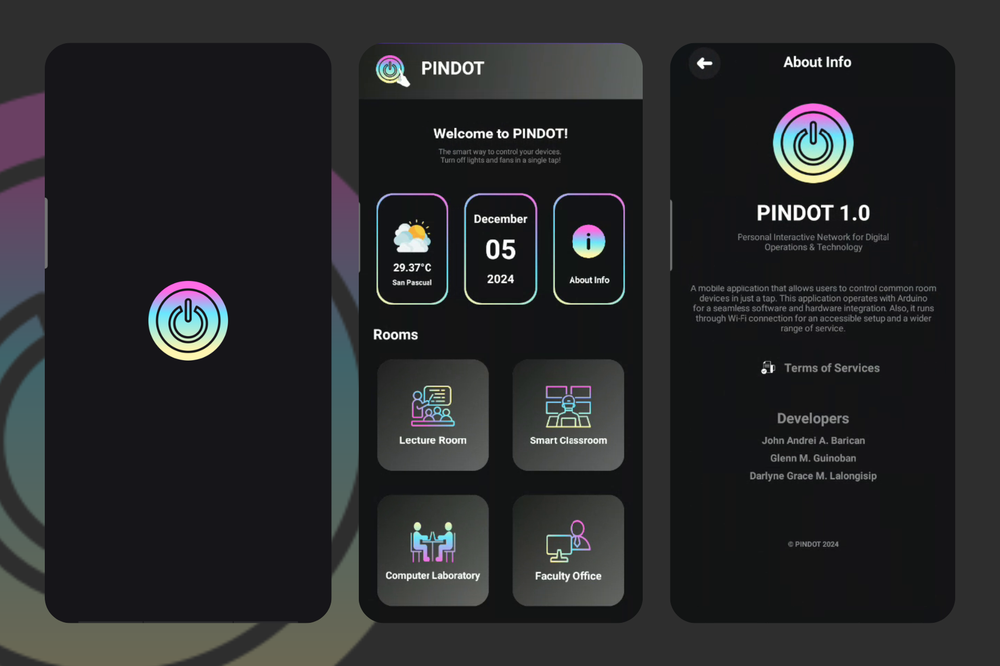

# 📱 Personal Interactive Network for Digital Operations & Technology (PINDOT)

Welcome to **PINDOT**, a smart home mobile application designed to simplify your living space. With PINDOT, control your room's electrical devices at your fingertips, ensuring comfort, efficiency, and ease of use.

<div align="center">  </div>

---


## 🌟 Features  
- **💡 Remote Device Control**: Turn electrical devices on or off with just a tap.  
- **🌡 Room Temperature Detection**: Monitor temperature and optimize ventilation.  
- **🔌 Expandable Device Integration**: Add additional electrical devices for smart control.  

---

## 📋 Future Enhancements  
- **🎙 Voice Assistant Integration**: Integrate with Google Assistant or Alexa for hands-free control.  
- **📊 Energy Usage Analytics**: Display energy consumption trends to optimize usage.  
- **🎨 Enhanced UI/UX**: Introduce a more user-friendly and modern design.  
- **🌈 Multi-Device Support**: Enable control across multiple rooms or homes.  
- **📱 Widget Support**: Add home screen widgets for quick device access.  
- **🔒 Advanced Security Features**: Implement two-factor authentication and encryption for enhanced safety.  

---

## 📱 Platform  
Developed using **Android Studio** for a seamless mobile experience.

---

## 🛠 Technologies  
- **Languages**: Java, XML  
- **Database**: Firebase Realtime Database  

---

## 🧩 Hardware Integration  
PINDOT is powered by **Arduino**, enabling smooth integration of hardware and software components for a responsive smart home solution.  

---

## 🌐 Connectivity  
The application operates via **Wi-Fi**, ensuring:  
- Wide-range device control.  
- Easy and accessible setup for users.  

---

## 🚀 Getting Started  

### Prerequisites  
- Install **Android Studio** on your machine.  
- Ensure you have an Arduino setup with compatible devices and firmware.  
- Firebase project set up with Realtime Database enabled.  

### Installation  
1. Clone the repository:  
   ```bash
   git clone https://github.com/yourusername/PINDOT.git

---

### 📹 Video Demonstration
Experience PINDOT in action! Watch the video below to see how it works:

[Video Demonstration](https://drive.google.com/file/d/1bCKzEduGCRNmorQ_gpcnfvDQUBGHBJ5l/view?usp=sharing)

---

## 👨‍💻 Developers  
Meet the team behind **PINDOT**:  

- [Barican, John Andrei A.](https://github.com/e4677)  
- [Guinoban, Glenn M.](https://github.com/glngnbn)  
- [Lalongisip, Darlyne Grace M.](https://github.com/drlyngrc)  

---

